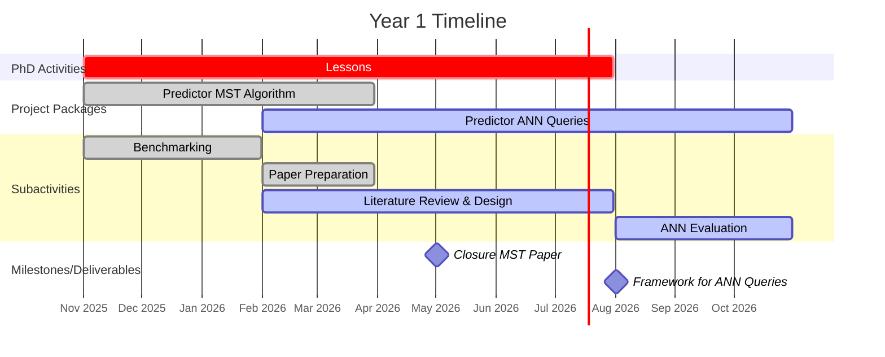
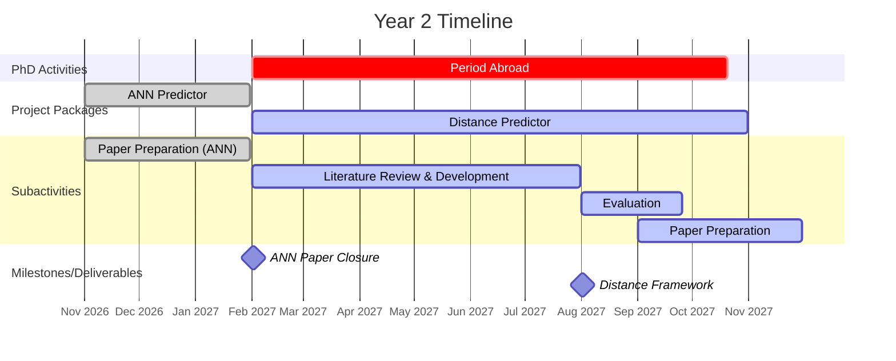
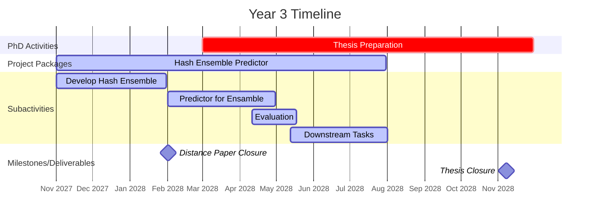

---
# You can also start simply with 'default'
theme: default
# random image from a curated Unsplash collection by Anthony
# like them? see https://unsplash.com/collections/94734566/slidev
background: https://cover.sli.dev
# some information about your slides (markdown enabled)
title: Enriching Similarity Search Algorithms with Predictors
titleTemplate: '%s'
author: 'Francesco Pio Monaco'
info: |
  PhDProject
# apply unocss classes to the current slide
class: text-center
# https://sli.dev/features/drawing
drawings:
  persist: false
# slide transition: https://sli.dev/guide/animations.html#slide-transitions
transition: slide-left
# enable MDC Syntax: https://sli.dev/features/mdc
mdc: true
# open graph
# seoMeta:
#  ogImage: https://cover.sli.dev

---

# Enriching Similarity Search Algorithms with Predictors

  
    Francesco Pio Monaco, June 2025
  

---
transition: fade
---

# The Setting
A continuos increase in the volume of data

 

 - We want to analyze and extract information from large amounts of data.

 - We need to find efficient techniques to deal with this data.

 - Many mining algorithms scale with super linear time complexity.

---
transition: fade
---

# The Setting
Similarity Search

 

- Similarity search is a fundamental task where we want to find the most similar elements in a collection of elements.
 

- In particular, we are interested in the Approximate Near Neighbor Search (ANNS) problem.

   - Given a set of elements and a query, we want to find the elements in the set that are closest to the query.
   - This procedure is used in applications like time series analysis to find common patterns, Minimum Spanning Tree to find the minimal edges, recommender systems to find similar elements to propose.

---
transition: fade
---

# A Recent Development
Algorithms with Predictions

 

- Algorithms with predictions is a new framework to design algorithms that use a predictor to improve their performance.

- They keep the theoretical guarantees of the original algorithm while improving their performance in the average case.

- The predictors are usually neural models trained on data that is similar to the one used in the algorithm.
---
transition: fade
---

# Algorithms with Predictions
The current challenges

 

- Neural predictors need to be trained using specific techniques (e.g., conformal or calibrated predictions) 

- Need lots of data to reach theoretical guarantees on the predictions.

- Not easy to deploy in real-world applications.

 

Idea:

- We can use hash structures to obtain deployable and robust predictors.

---
transition: fade
---

# Goals of the project
What is the plan?
 

- We want to integrate hash structures in the algorithms with predictions framework.

    - We obtain robust predictors that are easy to initialize and deploy.
    - We address the challenges posed by high-dimensional data in ANNS.
    - We derive mechanisms that can be expandend in several downstream tasks.
 
---
transition: fade
---

# Goals of the project
What is the plan?
 

- We want to integrate hash structures in the algorithms with predictions framework.

    - We obtain robust predictors that are easy to initialize and deploy.
    - We address the challenges posed by high-dimensional data in ANNS.    
    - We derive mechanisms that can be expandend in several downstream tasks.

 

- We expand in the offline setting.

    - The algorithm with predictions framework started for streaming data.
    - In the last months some works showed that it is beneficial also in the offline one.

---
transition: fade
---

# A predictor for hash indices
Faster ANN search

 

-  Setting:
    Hash indices, structures to answer Approximate Near Neighbor Queries, are used for many downstream tasks like clustering, recommender systems or pattern matching.

    Some hash indices, like PUFFINN*, are data adaptive and don't have a set of parameters to tune, making them more general.

-  Problem:
     Data adaptive hash indices are usually slower than the non-adaptive ones during the search operation, we would like to reduce search time.

-  Solution:
    We implement a predictor based on clusters and coresets that drives the search of the hash index. Saving time during the search operation.

 

###### *([Aumüller et al., 2020](https://arxiv.org/abs/1906.12211))
---
transition: fade
---

# A predictor for hash indices
Faster ANN search

<HashTreeAnimation />

---
transition: fade
---

# A Bloom filter predictor for distance approximations
Faster distance computations in ANN

 

-  Setting:
    Computing distances between elements is fundamental in tasks of ANN.

-  Problem:
    Computing distances is expensive, especially in high dimensional spaces. We want to approximate the distance between elements using a small subset of their dimensions.
    Current methods to approximate distances have known problems on robustness.

-  Solution:
    We implement a sensitive Bloom filter predictor to select the most relevant dimensions and estimate the distance between elements. We expect it to be robust given the theoretical properties of the Bloom filter.

---
transition: fade
---

# A Bloom filter predictor for distance approximations
Faster distance computations in ANN

<Bloom />

---
transition: fade
---

# Some Results in the literature
How much can predictors help? An application to triangle counting in graphs

 

###### *([Boldrin, Vandin, 2024](https://arxiv.org/pdf/2409.15205))

---
transition: fade
---

# Some Results in the literature
How much can predictors help? An application to motif discovery in multivariate time series

<table class="w-full text-xs border-collapse border border-gray-300">
  <thead>
        <th class="border px-1 py-0.5">dataset</th>
        <th class="border px-1 py-0.5">n (length)</th>
        <th class="border px-1 py-0.5">D (dimensionality)</th>
  </thead>
    <tbody>
    <tr>
      <td class="border px-1 py-0.5">potentials</td>
      <td class="border px-1 py-0.5">2 500</td>
      <td class="border px-1 py-0.5">8</td>
    </tr>
    <tr>
      <td class="border px-1 py-0.5">evaporator</td>
      <td class="border px-1 py-0.5">7 000</td>
      <td class="border px-1 py-0.5">5</td>
    </tr>
    <tr>
      <td class="border px-1 py-0.5">RUTH</td>
      <td class="border px-1 py-0.5">14 859</td>
      <td class="border px-1 py-0.5">32</td>
    </tr>    
    <tr>
      <td class="border px-1 py-0.5">weather</td>
      <td class="border px-1 py-0.5">100 057</td>
      <td class="border px-1 py-0.5">8</td>
    </tr>    
    <tr>
      <td class="border px-1 py-0.5">whales</td>
      <td class="border px-1 py-0.5">450 001</td>
      <td class="border px-1 py-0.5">32</td>
    </tr>    
    <tr>
      <td class="border px-1 py-0.5">quake</td>
      <td class="border px-1 py-0.5">6 440 998</td>
      <td class="border px-1 py-0.5">32</td>
    </tr>    
    <tr>
      <td class="border px-1 py-0.5">el_load</td>
      <td class="border px-1 py-0.5">6 960 008</td>
      <td class="border px-1 py-0.5">10</td>
    </tr>    
    <tr>
      <td class="border px-1 py-0.5">LTMM</td>
      <td class="border px-1 py-0.5">25 132 289</td>
      <td class="border px-1 py-0.5">6</td>
    </tr>
    </tbody>
</table>

 

###### *([Ceccarello, Monaco, Silvestri, 2025](https://arxiv.org/pdf/2502.14446))

---
transition: fade
---

# Experimental Results
Time to find the top motif in seconds

<table class="w-full text-xs border-collapse border border-gray-300">
  <thead>
    <tr>
      <th class="border px-1 py-0.5">dataset</th>
      <th class="border px-1 py-0.5" colspan="2">LEIT-motifs</th>
      <th class="border px-1 py-0.5">MSTUMP</th>
      <th class="border px-1 py-0.5">EMD</th>
      <th class="border px-1 py-0.5">RP</th>
    </tr>
    <tr>
      <th></th>
      <th class="border px-1 py-0.5">Index build</th>
      <th class="border px-1 py-0.5">Total</th>
      <th></th>
      <th></th>
      <th></th>
    </tr>
  </thead>
  <tbody>
    <tr>
      <td class="border px-1 py-0.5">potentials</td>
      <td class="border px-1 py-0.5">0.11</td>
      <td class="border px-1 py-0.5 bg-green-100 text-black">0.51</td>
      <td class="border px-1 py-0.5">3.65</td>
      <td class="border px-1 py-0.5">4.80</td>
      <td class="border px-1 py-0.5">3.20</td>
    </tr>
    <tr>
      <td class="border px-1 py-0.5">evaporator</td>
      <td class="border px-1 py-0.5">0.16</td>
      <td class="border px-1 py-0.5 bg-green-100 text-black">0.55</td>
      <td class="border px-1 py-0.5">4.45</td>
      <td class="border px-1 py-0.5">12.95</td>
      <td class="border px-1 py-0.5">6.78</td>
    </tr>
    <tr>
      <td class="border px-1 py-0.5">RUTH</td>
      <td class="border px-1 py-0.5">2.91</td>
      <td class="border px-1 py-0.5 bg-green-100 text-black">8.10</td>
      <td class="border px-1 py-0.5">84.04</td>
      <td class="border px-1 py-0.5">1.5h</td>
      <td class="border px-1 py-0.5">2.3h</td>
    </tr>
    <tr>
      <td class="border px-1 py-0.5">weather</td>
      <td class="border px-1 py-0.5">15.04</td>
      <td class="border px-1 py-0.5 bg-green-100 text-black">33.37</td>
      <td class="border px-1 py-0.5">1035.73</td>
      <td class="border px-1 py-0.5">-</td>
      <td class="border px-1 py-0.5">1.2h</td>
    </tr>
    <tr>
      <td class="border px-1 py-0.5">whales</td>
      <td class="border px-1 py-0.5">60.67</td>
      <td class="border px-1 py-0.5 bg-green-100 text-black">2.2 h</td>
      <td class="border px-1 py-0.5">(2.7 days)</td>
      <td class="border px-1 py-0.5">-</td>
      <td class="border px-1 py-0.5">-</td>
    </tr>
    <tr>
      <td class="border px-1 py-0.5">quake</td>
      <td class="border px-1 py-0.5">175.3</td>
      <td class="border px-1 py-0.5 bg-green-100 text-black">3.6 h</td>
      <td class="border px-1 py-0.5">(7.2 days)</td>
      <td class="border px-1 py-0.5">-</td>
      <td class="border px-1 py-0.5">-</td>
    </tr>
    <tr>
      <td class="border px-1 py-0.5">el_load</td>
      <td class="border px-1 py-0.5">180.2</td>
      <td class="border px-1 py-0.5 bg-green-100 text-black">2.8 h</td>
      <td class="border px-1 py-0.5">(8.4 days)</td>
      <td class="border px-1 py-0.5">-</td>
      <td class="border px-1 py-0.5">-</td>
    </tr>
    <tr>
      <td class="border px-1 py-0.5">LTMM</td>
      <td class="border px-1 py-0.5">240.6</td>
      <td class="border px-1 py-0.5 bg-green-100 text-black">15.6 h</td>
      <td class="border px-1 py-0.5">(11.8 days)</td>
      <td class="border px-1 py-0.5">-</td>
      <td class="border px-1 py-0.5">-</td>
    </tr>
  </tbody>
</table>

---
transition: fade
---

# Extra
A Computer Vision application

- A CNN is used conjunctly with an LSTM to create a textual description of the people in a video stream.

- To reverse search in a video from a textual description a hash index is used to find the matching frames.

- The description creates a textual embedding, ANN search finds the closest frames in the hash index, the frames are then retrieved and the CNN is used to find the people in the frames.

 

###### *([Yuenyoung et al., 2022](https://www.mdpi.com/2504-2289/6/4/136))

---
transition: fade
---

# Extra
An industry application

- A hash index is used to cluster behaviours of a set of sensors in an incinerator.

- A dictionary of behaviours helps the recognition of anomalies.

- The project was carried out in collaboration with beanTech IT.

---
transition: fade
---

# A predictor for hash ensembles
Improving quality for drifting data

 

-  Setting:
     Ensembles are a family of algorithms that use multiple models to improve the performance. They are used in many neural tasks. Extremely useful to deal with data drift.

-  Idea:
    We want to extend the idea of ensembles to the hash setting. We want to use multiple hash indices to improve the performance of the search and support mixture data.

-  Solution:
    We implement an ensembles of hash indices, indices will complement each other on different data distributions. A predictor will be used to select the best hash index for the current data distribution.

---
transition: fade
---

# A predictor for hash ensembles
Improving quality for drifting data

<Ensemble />

---
transition: fade
layout: center
---

# ThanKs foR   yOuR AttenTion

---
transition: fade
---

# Extra
Timeline

---
transition: fade
---

# Extra
Timeline

---
transition: fade
---

# Extra
Timeline

